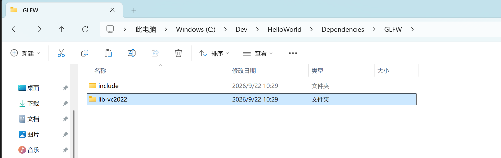
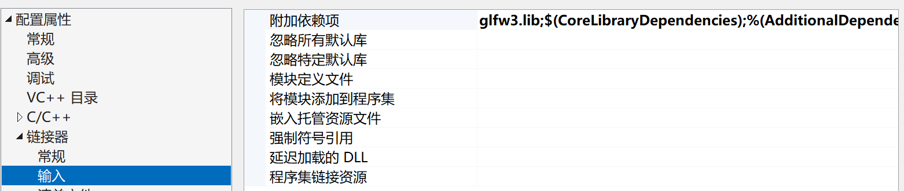

## 预编译二进制文件和自己手动编译
预编译二进制文件是指已经在特定平台上编译好的可执行文件或库文件，用户可以直接安装和运行，无需再次编译

### 32位二进制文件和64位二进制文件
取决于你的目标应用程序

## c++库结构
- includes包含目录
  - 由头文件组成，包含可用的符号声明
- library库目录
  - 由预先编译的二进制文件组成，其中包含动态库和静态库，包含符号声明的实际定义。

## 静态链接 vs 动态链接
- 静态链接：静态库会被放到可执行文件中
- 动态链接：在运行时装载动态库
  
## library目录
- .dll文件：运行时动态链接库，最简单的方式是放在.exe文件所在目录，以便windows loder找到dll文件
- .lib文件：静态链接库
- dll.lib文件：配合dll文件使用，真正干活的是dll文件。在编译链接阶段，帮助你的程序找到 DLL 中函数的一份“索引/说明文件”。
  
## 头文件使用引号和尖括号的区别
尖括号 < >  
编译器只在系统头文件搜索路径中查找，通常包括：  
标准库路径（如 /usr/include、/usr/local/include）  
编译器附加包含目录  
引号 " "  
编译器先在当前源文件所在目录查找，如果没找到，再回退到系统路径查找。

## 为VisualStudio添加外部库
### 在解决方案目录创建dependencies文件夹作为库文件目录

### 创建外部库标识文件夹，例如GLFW，并将对应的includes和library放入

### 为项目添加附加包含目录

### 为项目添加附加库目录

### 为项目添加附加依赖项


                 GLFW 源码
                    │
          _GLFW_BUILD_DLL
                    │
                    ▼
         __declspec(dllexport)
                    │
                    ▼
           ┌─────────────────┐
           │    glfw3.dll    │
           │                 │
           │  glfwInit()     │
           │  glfwPollEvents │
           │  ...            │
           └─────────────────┘
                    │
             产生导入信息
                    │
                    ▼
             glfw3dll.lib
                    │
                    │ 链接
                    ▼
              MyGame.exe
                    │
             GLFW_DLL
                    │
                    ▼
         __declspec(dllimport)
                    │
                    │ 运行时加载
                    ▼
                glfw3.dll

## __declspec(dllimport)
dllimport 是明确告诉编译器：这个符号来自 DLL。
```c++
#include <GLFW/glfw3.h>

int main()
{
    glfwInit();
}
```

如果没有```#define GLFW_DLL```

GLFWAPI int glfwInit(void); == int glfwInit(void);

但如果项目链接glfw3dll.lib  

编译器：  
“glfwInit 是个外部函数。”  
        │  
        ▼  
链接器：  
“我在 glfw3dll.lib 里找到它了，  
原来它最终来自 glfw3.dll。”  
        │  
        ▼  
生成 EXE 的 DLL 导入信息  
        │  
        ▼  
Windows Loader：  
“启动时加载 glfw3.dll。”  
        │  
        ▼  
程序正常运行  