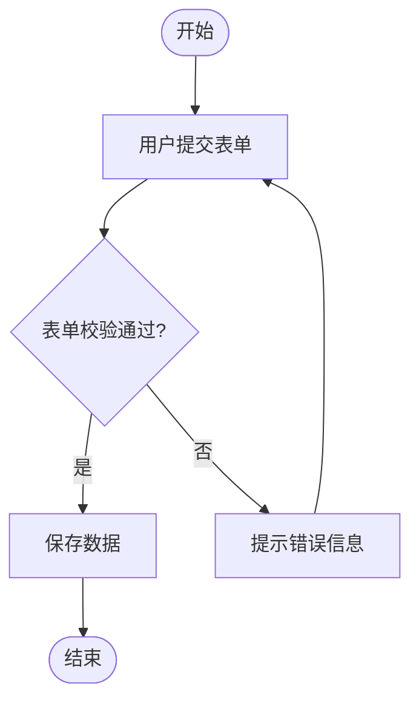

# 一级标题
## 二级标题
### 三级标题
#### 四级标题

**加粗**

*斜体*

***加粗斜体***


~~删除线~~

`行内代码`

## 无序列表（用 -、* 或 +）：  
- 项目一
- 项目二
  - 子项目
    - 子子项目

## 有序列表（用数字加点）：
1. 第一项
2. 第二项

## 链接与图片
[杭电研究生院官网](https://grs.hdu.edu.cn)  
[杭电官网](https://example.com "hdu")  


## 代码块
```c++
void hello()
{
    std::cout << "hello" <<std::endl;
}
```

## 表格
对齐方式（冒号位置）：

:--- 左对齐

:---: 居中

---: 右对齐
| 姓名 | 年龄 | 城市 |
|:---:|:----|-----:|
| 张三 | 25   | 北京 |
| 李四 | 30   | 上海 |
|李中政|24|杭州|


## 分割线
---
***
___

## 换行与段落
+ 直接空一行
+ 行末加两个空格

## 任务列表
- [x] 已完成任务
- [ ] 未完成任务

## Alerts提示块
> [!NOTE]
> 补充说明

> [!WARNING]
> 警告内容

> [!IMPORTANT]
> 重要

> [!TIP]
> 小贴士

> [!CAUTION]
> 注意

## 脚注
正文引用[^1]

[^1]: 脚注内容


## 其他仓库文档引用
[文档](docs/CONTRIBUTING.md)

## 图表

